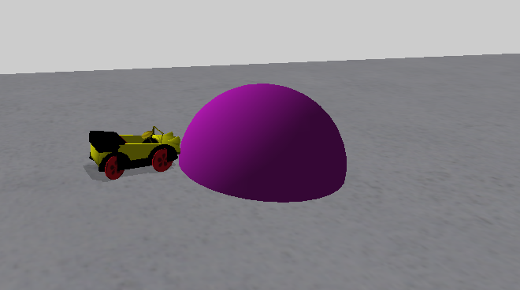
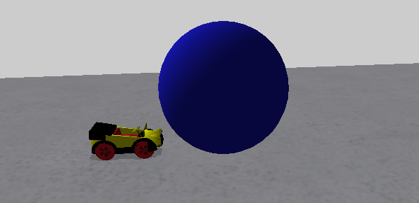
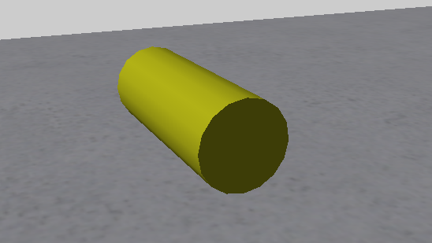
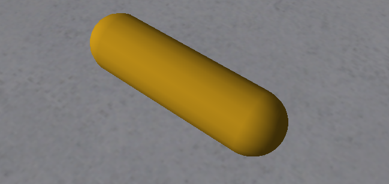
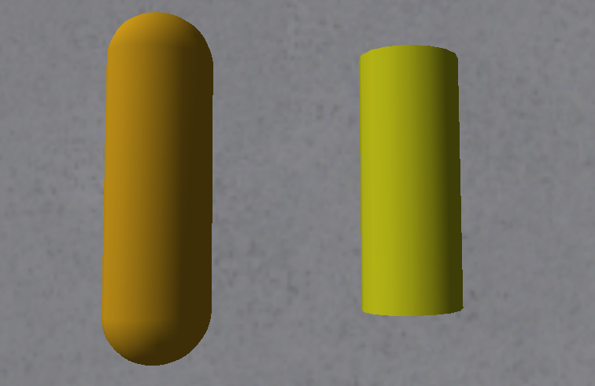
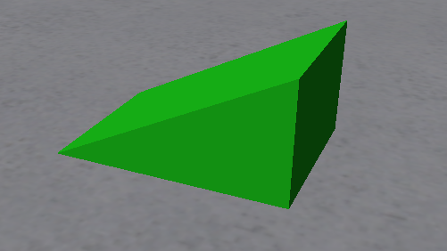

## Part 2 - More Target Agents (Shapes)

As mentioned in Part 1, the cube was a type of "Target", an agent that has a few different types. We will be briefly going over the other types in this part, but not in the same detail as most of the parameters will work in the same way.

### Sphere

	4 = 
	{
	    "agent" = "Target"
	    "params" = 
	    {
	    	"shape" = "sphere"
	    	"position" = (0, 0, 0)
	    	"scale" = (5, 0, 0)
	    	"eulers" = (0, 0, 0)
	    	"solid" = 1
	    	"movable" = false
	  	
	    	"visible" = 1
	    	"red" = 0.7
	    	"green" = 0.1
	    	"blue" = 0.7
	    }
	}

A sphere's origin is its center, which means a Y position of 0 means that half the sphere is above the table and half is below it.

Scale works a bit differently with spheres. If you only have 1 number above zero, it will act as the radius of the sphere, but if you have more than 1 number, it will take the euclidean distance of the 3 values For example, a sphere with a scale of (5, 0, 0) has a radius of 5, which would touch the center face of a (10, 10, 10) cube in the same location (the cube would enclose the sphere). But a (5, 5, 5) cube's radius would touch the corner of the same cube (the sphere would enclose the cube).

### Ball

Ball is almost identical to sphere, the only difference is that the origin is at the bottom of the agent, rather than the center. This is quite handy for when you want one placed on the surface of the table, as the position's Y value will always be 0 nomatter the size.

	5 = 
	{
	    "agent" = "Target"
	    "params" = 
        {
	    	"shape" = "ball"
	    	"position" = (0, 0, 0)
	    	"scale" = (5, 0, 0)
	    	"eulers" = (0, 0, 0)
	    	"solid" = 1
	    	"movable" = false
	    	
	    	"visible" = 1
	    	"red" = 0.1
	    	"green" = 0.1
	    	"blue" = 0.8
	    }
	}

As you can see, a ball with identical parameters to a sphere (except colour) is all above the table.

### Cylinder

	6 = 
	{
	    "agent" = "Target"
	    "params" = 
	    {
	    	"shape" = "cylinder"
	    	"position" = (0, 0, 0)
	    	"scale" = (4, 0, 10)
	    	"eulers" = (0, 0, 0)
	    	"solid" = 1
	    	"movable" = false
	    	
	    	"visible" = 1
	    	"red" = 0.8
	    	"green" = 0.8
	    	"blue" = 0.1
	    }
	}

The 'length' of a cylinder is its Z value. The X and Y values work in a similar way to spheres, where if only 1 value given, it will be the radius, but if 2 are it will be the euclidean value.

To make a cylinder stand vertically, you can rotate it 90 degrees about the X-axis i.e.:

	"eulers" = (90, 0, 0)

### Capsule

	7 = 
	{
	    "agent" = "Target"
	    "params" = 
	    {
	    	"shape" = "capsule"
	    	"position" = (0, 0, 0)
	    	"scale" = (4, 0, 10)
	    	"eulers" = (0, 0, 0)
	    	"solid" = 1
	    	"movable" = false
	    	
	    	"visible" = 1
	    	"red" = 0.8
	    	"green" = 0.6
	    	"blue" = 0.1
	    }
	}

A capsule is similar to a sphere but with rounded ends. Like the cylinder, the scale Z-value is the 'length' of the capsule. However, a capsule's length includes both the Z-value, and the radii of the rounded ends so a capsule will be longer than a cylinder with the same scale.

Capsules have some odd physics when movable (little to no friction when on their sides) so they are often fixed in place when used as an obstacle.

### Wedge

A wedge is like a cube that's been sliced along a diagonal. The diagonal goes along the Z-axis.

	8 = 
	{
	    "agent" = "Target"
	    "params" = 
	    {
	    	"shape" = "wedge"
	    	"position" = (0, 0, 0)
	    	"scale" = (7, 5, 10)
	    	"eulers" = (0, 0, 0)
	    	"solid" = 1
	    	"movable" = false
	    	
	    	"visible" = 1
	    	"red" = 0.1
	    	"green" = 0.8
	    	"blue" = 0.1
    	}
	}

The diagonal face of the wedge does not have proper collision detection (except in Street Rules) so it's not recommended to use it as an obstacle.

Including the cube, these are all the shapes that fall under the "Target" agent. They provide enough to make obstacles for a wide variety of contests. There are other agents that can be used as obstacles but most of the are a bit more niche, we will be seeing them in future parts though.

If you would like a contest file containing all these Target agents as a reference, I have provided one [here](<resources/Part 2/Contests/TUTORIAL_TARGETS.contest>).
