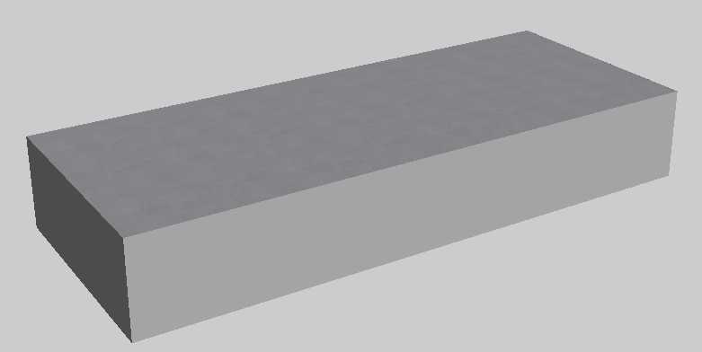
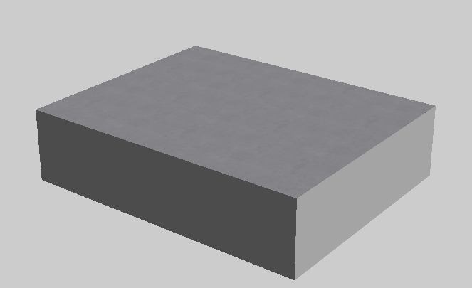
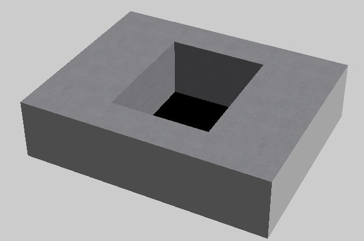
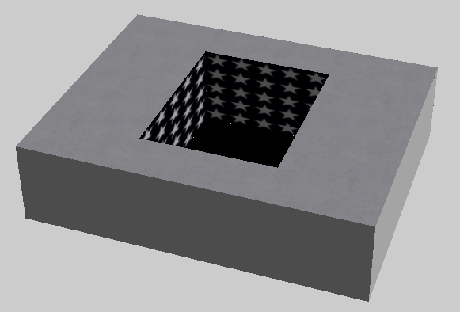
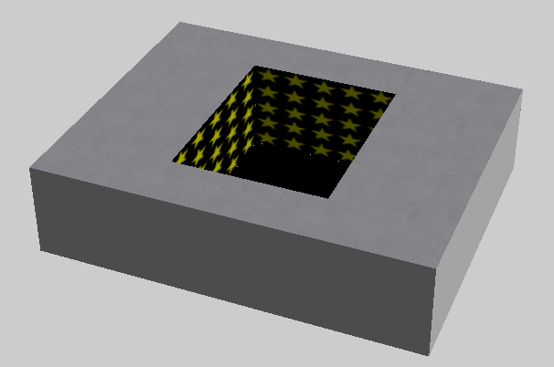

## Part 3 - PoloTable (The Table)

In every contest so far, we have seen the giant grey block that is the table, and if you've looked at the contest files, you can probably guess it's represented by the "PoloTable" agent. There are a few differences between this agent and a really big "cube".

	1 = 
	{
		"agent" = "PoloTable"
		"params" = 
		{
			"x" = 157.5
			"y" = 25
			"z" = 63
			"position" = (0, 0, 0)
			"description" = ""
			"group" = "0"
			"hole_x" = 0
			"hole_z" = 0
		}
		"type" = ""
	}

### Scale - xyz

Unlike "Target" agents which have a single parameter, the table's scale is defined with individual "x", "y" and "z" parameters which represent the length, height and depth of the respectively.

Pretty much every table from the original contests have the same scale but you can change it if you like:

	1 = 
	{
		"agent" = "PoloTable"
		"params" = 
		{
			"x" = 80
			"y" = 25
			"z" = 100
			"position" = (0, 0, 0)
			"description" = ""
			"group" = "0"
			"hole_x" = 0
			"hole_z" = 0
		}
		"type" = ""
	}

While you can change the value of "y", it is not recommended as many aspects of the table will stay at a fixed value of 25 (1 metre high) so the change won't do what you intend it to. Since the table represented a physical table in the real world, the developers didn't make it too flexible.

### The Hole

A key difference between the table and a regular cube is that you can have a hole in the top of the table using "hole_x" and "hole_z".

	1 = 
	{
		"agent" = "PoloTable"
		"params" = 
		{
			"x" = 80
			"y" = 25
			"z" = 100
			"position" = (0, 0, 0)
			"description" = ""
			"group" = "0"
			"hole_x" = 50
			"hole_z" = 40
		}
		"type" = ""
	}

Unsurprisingly, a "hole_x" and "hole_z" value of 0 means that there's no hole in the table.

Interestingly, if you don't provide the hole parameters at all, then the table will include a default hole size of `"hole_x" = 7` and `"hole_z" = 10` which is the size of the hole in Weakest Zook.

### Texture

If you have a hole in the table, then you can make use of the "texture" parameter. This will not change the texture of the outside of the table, but it will change the texture of the inner walls of the hole:

	1 = 
	{
		"agent" = "PoloTable"
		"params" = 
		{
			"x" = 80
			"y" = 25
			"z" = 100
			"position" = (0, 0, 0)
			"description" = ""
			"group" = "0"
			"hole_x" = 50
			"hole_z" = 40
			"texture" = "stars_uniform"
		}
		"type" = ""
	}

You can also add colour:

	1 = 
	{
		"agent" = "PoloTable"
		"params" = 
		{
			"x" = 80
			"y" = 25
			"z" = 100
			"position" = (0, 0, 0)
			"description" = ""
			"group" = "0"
			"hole_x" = 50
			"hole_z" = 40
			"texture" = "stars_uniform"

			"red" = 1
			"green" = 1
			"blue" = 0
		}
		"type" = ""
	}

### Other differences

When you add the PoloTable to a contest, it adds more than the grey table, it is also adds the floor under the table. This means if you do not add the table to a contest, zooks will fall into an endless void.

Another thing it adds is an invisible wall behind the table, this is roughly where the contestants and Jake would be standing on the TV show so in the rare event something is flung off the table at a person it would give the illusion of it bouncing off them. This wall is important to be aware of if you have some sort of path for the zook that extends beyond the table.