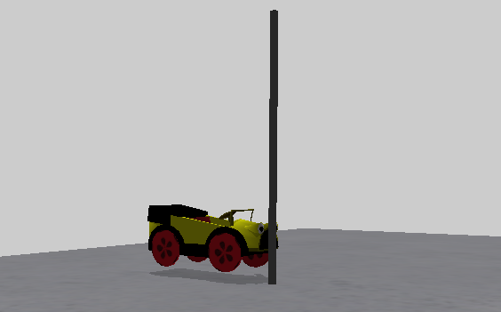
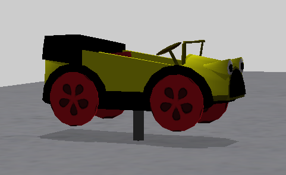
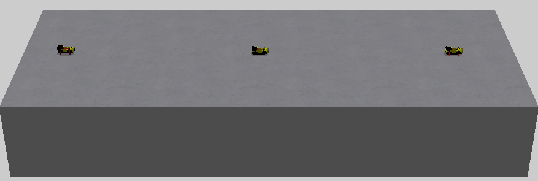

## Part 4 - The ZookPlaceHolder

A contest isn't any fun without Zooks and if you've looked at the sample (or any) contest files, you might have noticed the "ZookPlaceHolder", which is how they're put in the contests. Let's take a look at one:

	2 = 
	{
		"agent" = "ZookPlaceHolder"
		"params" = 
		{
			"position" = (-62, 0.1, 0)
			"eulers" = (0, -90, 0)
			"scale" = (1, 1, 1)
			"group" = "1"
			"description" = ""
			"hatpin" = (0, 0, 0)
			"flags" = "1"
			"movable" = 1
		}
		"type" = ""
	}

Position and eulers do the same thing as they would with other agents.

If you have looked at other contests, you may have noticed ZookPlaceHolders with a "scale" parameter of (1, 1, 1). This doesn't actually do anything and you don't need to provide it as a parameter. Unfortunately you cannot change the values to get a super huge zook. Remember this is for the placeholder not the zook itself.

"movable" works in an interesting way. Unsurprisingly, with a value of false, the zook will not move, but a new part will be visible:

	2 = 
	{
		"agent" = "ZookPlaceHolder"
		"params" = 
		{
			"position" = (-62, 0.1, 0)
			"eulers" = (0, -90, 0)
			"scale" = (1, 1, 1)
			"group" = "1"
			"description" = ""
			"hatpin" = (0, 0, 0)
			"flags" = "1"
			"movable" = false
		}
		"type" = ""
	}

This grey cylinder is the "hatpin" and acts as a visual indicator that the zook is 'pinned' in place. You can sometimes see it on the TV show during the selection before contests in series 2 and 3.

The "hatpin" parameter is the location of the hatpin cylinder, relative to the zook:

	2 = 
	{
		"agent" = "ZookPlaceHolder"
		"params" = 
		{
			"position" = (-62, 0.1, 0)
			"eulers" = (0, -90, 0)
			"scale" = (1, 1, 1)
			"group" = "1"
			"description" = ""
			"hatpin" = (-3, 0, 0)
			"flags" = "1"
			"movable" = false
		}
		"type" = ""
	}

### The ContestPack entry and picking the team

As well as the ZookPlaceHolder entry in the contest file, to get a selected zook on the table, you also need add something to the contestpack entry. Let's say our contest has one zook, our ContestPack entry might look something like this:

	"Tutorial - Zook Placeholder" = {
	"agents" = {
	}

	"rounds" = { 
		1 = {
			"name" = "Round 1"
			"contest" = "TUTORIAL_ZOOK_PLACEHOLDER"
			"contestants" = {
			1 = 1
			}
		}
	}

	"camera" = {
		"start" = (-20, 0, 0)
		"finish" = (20, 0, 0)
	}
	"picture" = "TUTORIAL_ZOOK_PLACEHOLDER.png"
	}

The key part of this is the `1 = 1`  within "contestants". The 1 on the left indicates the first ZookPlaceHolder found in the contest file, the 1 on the right represents wether the team is green or red. For this value, 1 represents the green team, 2 represents red. This means our contest will use the selected green contestant when running on the simulator. If we wanted to use the red contestant instead we would have:

	"contestants" = {
		1 = 2
	}

If you want a second zook, you will need to add another line for it, for example:

	"contestants" = {
		1 = 2
		2 = 1
	}

... Would configure the first ZookPlaceHolder in the contest to be the red team (2) and the second ZookPlaceHolder in the contest will be the green team (1).

If, for some reason, you wanted two zooks and both of them used the same team selection you can, for example:

	"contestants" = {
		1 = 2
		2 = 2
	}

... Would configure both ZookPlaceHolders to use the red team selection.

### Extra zooks

Perhaps you want a house zook or something like the final relay in your contest which means you need more than the two selected zooks. Fortunately you can provide extra zooks that don't require selection by adding the "contestant" parameter:

	4 = 
	{
		"agent" = "ZookPlaceHolder"
		"params" = 
		{
			"position" = (62, 0.1, 0)
			"eulers" = (0, -90, 0)
			"scale" = (1, 1, 1)
			"group" = "1"
			"description" = ""
			"hatpin" = (0, 0, 0)
			"flags" = "1"
			"movable" = 1
			"contestant" = 
			{
				"fullname" = "C:\<<PATH TO ZOOKS>>\Brum\1.0.zook"
			}
		}
		"type" = ""
	}

The "contestant" parameter has its own set of braces and a sub-parameter, "fullname", which takes a full file path to the zook you want to load. This will be different depending on your installation location.

