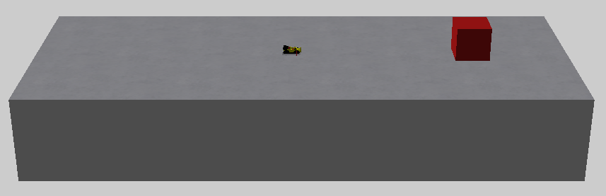
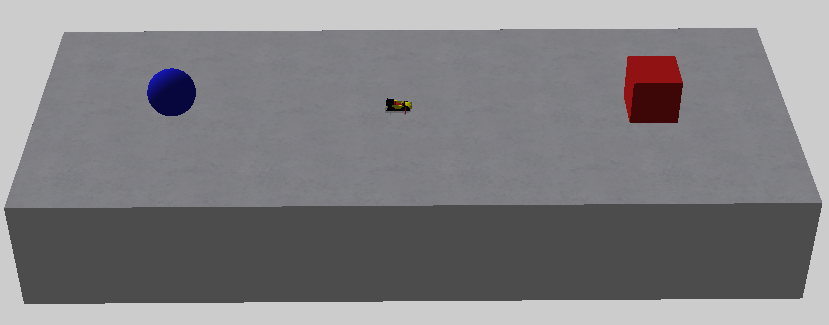

## Part 5 - The Follow Behaviour

In part 4, we put zooks on the table using ZookPlaceHolder, but the zooks just go in circles because they haven't been told to go anywhere. This is where we need a behaviour.

As mentioned in part 1, contest files are split into 2 parts, behaviours and agents with behaviours being the more complicated of the two. In this part we will be looking at the "Follow" behaviour which is by far the most commonly used, and often the only bahaviour needed for a contest.

The follow behaviour gives a zook an agent or sequence of agents to follow. Before we look at the behaviour, let's take a look at the agents it's going to reference:

	2 = 
	{
		"agent" = "ZookPlaceHolder"
		"params" = 
		{
			"scale" = (1, 1, 1)
			"group" = "1"
			"eulers" = (0, -90, 0)
			"position" = (0, 0.1, 0)
			"description" = ""
			"hatpin" = (0, 0, 0)
			"flags" = "1"
			"movable" = 1
		}
		"type" = ""
	}
	3 = 
	{
		"agent" = "Target"
		"params" = 
		{
			"shape" = "cube"
			"position" = (50, 0, 0)
			"scale" = (10, 10, 10)
			"eulers" = (0, 0, 0)
			"solid" = 1
			"movable" = false

			"visible" = 1
			"red" = 0.8
			"green" = 0.1
			"blue" = 0.1
		}
	}

This gives us a zook in the middle of the table and a cube near then end of the table.

We want our zook to follow the cube. The behaviour will reference agents by their id, 2 for the ZookPlaceHolder and 3 for the cube target.

Now for the behaviour:

	"behaviours" = 
	{
		1 = 
		{
			"id" = 1
			"owner" = 2
			"name" = "Follow"
			"params" = 
			{
				"startRandom" = false
				"loop" = 0
				"targets" = 
				{
					1 = 3
				}
			}
			"triggerOnEvents" = 
			{
				2 = 
				{
					"id" = -3
					"behaviour" = -2
				}
			}
			"triggerOffEvents" = 
			{
			}
			"destroyOnEvents" = 
			{
			}
			"description" = ""
		}
	}

Unsurprisingly, the follow behaviour goes in the "behaviours" section.

Like agents, behaviours follow the pattern of a unique number, followed by = and the contents inside a pair of curly braces.

`"id"` simply matches the id on the outside of the braces.

`"owner"` points to an agent id, every behaviour is 'owned' by an agent. In this case, it's the ZookPlaceHolder.

`"name"` is the name or type of behaviour

`"params"` like in agents, are the parameters of the behaviour. They are different depending on which behaviour it is, we will go into more detail on the specific parameters for follow later.

`"triggerOnEvents"` says when a behaviour should be active. The values:

	"id" = -3
	"behaviour" = -2

... May seem a bit confusing and arbitrary (which is true), but you just need to remember that these are special values that indicate that our behaviour should always be active.

`"triggerOffEvents"` defines any conditions that would switch off the behaviour. We don't want that to happen to our behaviour so we put nothing in here.

`"destroyOnEvents"` like "triggerOffEvents" defines conditions that would switch off the behaviour, the only difference is that "destroyOnEvents" permanantly removes the behaviour whereas a behaviour switched off with "triggerOffEvents" can be switched back on with "triggerOnEvents".

Now let's take a look at the parameters:

	"params" = 
	{
		"startRandom" = false
		"loop" = 0
		"targets" = 
		{
			1 = 3
		}
	}

The main parameter here is "targets", which lists the agents the zook has to follow. In this example we have:

	1 = 3

Which tells the contest, the first (and only) target the zook should follow is agent 3, which in our case is the cube at the end of the table.

`"startRandom"`, if set to 1 (true) will make the zook initially follow a random target in "targets" whereas if set to false, will start with the first target. Since we only have one target it doesn't matter either way.

`"loop"` is the number of extra times the zook should follow the sequence of targets. Again, since we only have one target this won't do anything.

Let's make things a bit more interesting and add another target:

	4 = 
	{
		"agent" = "Target"
	    	"params" = 
    		{
		    	"shape" = "ball"
		    	"position" = (-50, 0, 0)
		    	"scale" = (5, 0, 0)
		    	"eulers" = (0, 0, 0)
		    	"solid" = 1
		    	"movable" = false
		    	
		    	"visible" = 1
		    	"red" = 0.1
		    	"green" = 0.1
		    	"blue" = 0.8
    		}
	}

If we want our zook to touch the cube and then the ball, then we need to add the ball's id to the behaviour:

	"params" = 
	{
		"startRandom" = false
		"loop" = 0
		"targets" = 
		{
			1 = 3
			2 = 4
		}
	}

Now the zook will first follow the cube (3), and once it makes contact, it will then follow the ball (4). Since the ball is the last target, the zook will still go  towards it even after making context.

Now let's say we want the zook to go back and forth between the two targets a few times. We could list the targets multiple times like so:

	"targets" = 
	{
		1 = 3
		2 = 4
		3 = 3
		4 = 4
	}

... but this would be a bit redundant. What we can do instead is make use of "loop":

	"params" = 
	{
		"startRandom" = false
		"loop" = 4
		"targets" = 
		{
			1 = 3
			2 = 4
		}
	}

This will make the zook repeat the targets 5 times (the initial run plus 4 loops).

Let's spice things up even more

	"params" = 
	{
		"startRandom" = 1
		"loop" = 4
		"targets" = 
		{
			1 = 3
			2 = 4
		}
	}

This will now give a 50/50 change of the zook initially targeting the ball instead

Note that if the zook initially targets the ball in this case it gets a 'head start' as it will still finish targeting the ball and not get an 'extra' cube follow.

### TL;DR

Since there was a lot to unpack for this one, here's a short summary of what you probably want to do when you need this behaviour:

1. Copy an existing "follow" behaviour
2. Change the "id" (inside and out) to something unique in your behaviours
3. Set the "owner" to be the agent id of the ZookPlaceHolder you want to use this behaviour
4. List the sequence of agents to follow in "targets"

### Common usage

Zooks aren't often seen chasing a particular agent in real contests. That's because most targets used for following are invisible and non-solid using the parameters:

	"visible" = false
	"solid" = false

Which gives the illusion of the zook finding a path or avoiding obstacles in a more intelligent way.

It's also worth mentioning a ZookPlaceHolder can also be a target listed in a "Follow" behaviour to have zooks chasing other zooks.