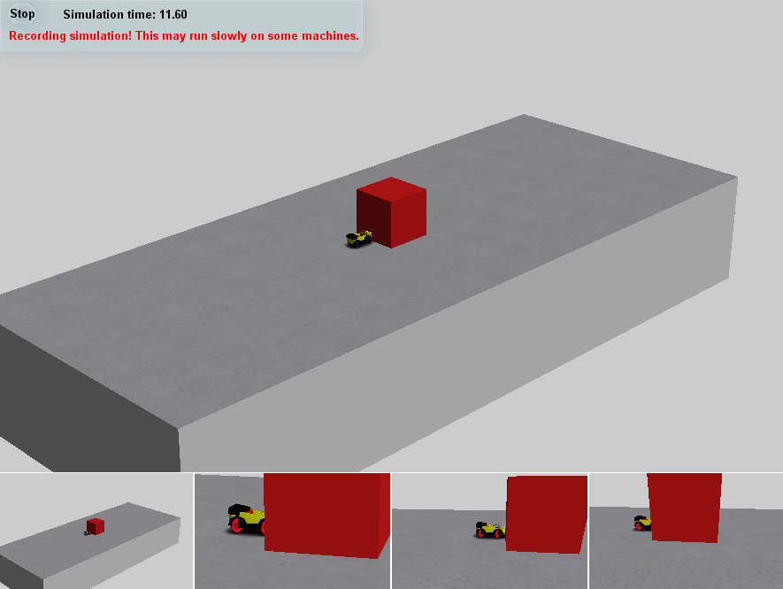
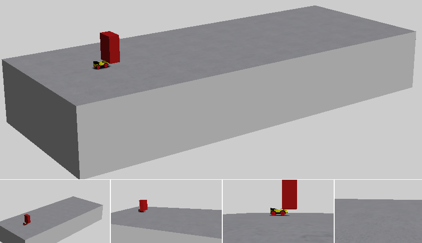
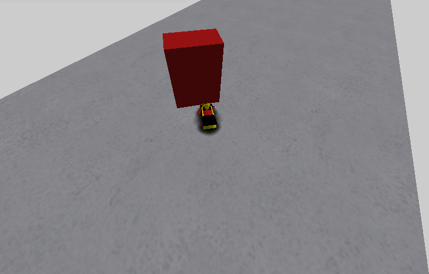

# How to make a contest by Shoe

## Introduction - Where things are

- All files concerned with contest building can be found under the directory:
`C:/Program Files (x86)/BAMZOOKi`

- You will need to have administrator privileges to edit these files

- `C:/Program Files (x86)/BAMZOOKi/Contests/Contest Pack` contains 2 types of file:
  - *.contest* files contain pretty much everything about a given contest. This is what you will work with most when building contests
  - *.png* images which are just the images that you see on the simulator

- `C:/Program Files (x86)/BAMZOOKi/ContestsPacks` contains 1 file, *ContestPack1.dat* which tells the simulator:
  - The contests to be listed
  - Their display names
  - The images they're associated with them
  - some information on what happens to the selected zooks and scores if the contest has them

For a new contest to be listed in the simulator you will need to add a new entry to either ContestPack1.dat or a new .dat file in the same location. I would recommend  the latter to keep any custom contests separate from the originals.

Both the *.dat* and *.contest* files can be opened and edited with most text editors, such as notepad. But there are benefits to using an editor built for code, [Sublime](https://www.sublimetext.com/) and [Notepad++](https://notepad-plus-plus.org/) are both good choices.

The contents of these files use a markup language only used by BAMZOOKi, it's visually similar to [JSON](https://www.json.org/json-en.html), but more closely related to [table syntax in LUA](https://www.lua.org/pil/2.5.html). Don't worry if you haven't heard of either of these as we will be learning it from scratch.

When making edits to a contest that is alreadly listed on the simulator, you only need to save the contest file and re-run the contest to see the changes (no need to restart the simulator).

In summary, a new contest requires:
- A *.contest* file
- An entry in *ContestPack1.dat* or a .dat file in the same location for it to be listed in the simulator
- An image for the simulator

## Part 1 - A cube

The contest file is split into two parts; Behaviours and Agents.

Agents are the physical objects that you see in a contest, and behaviours are the rules on how these agents interact with eachother.

Agents are the simplest place to start so we will leave behaviours for now.

Each agent has a number which is a unique id, it doesn't have to be in order and can be any number as long as it's unique; if you have two agents with the same id only one of them will show up in the contest.

There are a fixed number of types of agents, most of them being simple 3D shapes such as a cube or a cylinder. Some are more complex like swinging doors or the zook placeholder but for now we will be looking at the cube.

Before we begin, I've made an [empty contest](<resources/Part 1/Contests>) for us to make a cube in. All it has is a table and a zook to run across it. We will be using the zook to see how it interacts with the cube.

We start with a unique number for the id, which can be the increment of the last agent, along with an equals sign, and a pair of curly braces:

    4 = {}

We will now put all the information about this agent inside the parentheses.

We then say what kind this agent is with the "agent" key, you may think we say cube here but actually it's called a "Target"

    4 = 
    {
    	"agent" = "Target"
    }

"Target" is a type of agent that covers a wide range of shapes that share common values, including the cube.
So we've now told the contest we want a target, we now need to say we want it to be a cube, along with any other information about it, it's size, position, colour... we need to give it parameters. For this, we use the "params" key, and another pair of curly braces

    4 = 
    {
    	"agent" = "Target"
    	"params" = 
    	{
    	}
    }

To say we want this Target to be a cube, we use the "shape" parameter:

    4 = 
    {
    	"agent" = "Target"
    	"params" = 
    	{
    		"shape" = "cube"
    	}
    }

You may be noticing a pattern where we have a key, followed by an equals sign, followed by a value. If you look close enough, you will find everything in the contest file follows this pattern!

Every parameter will be a key value pair within these new curly braces. 

We will first define the position and size of the cube, using the "position" and "scale" parameters:

	"params" = 
	{
		"shape" = "cube"
		"position" = (0, 0, 0)
		"scale" = (10, 10, 10)
	}

Notice the values on the right hand side of both parameters hold three numbers in parentheses, the numbers are for the x, y and z axis.

For position, (0, 0, 0) is the top-center of the table. For scale, each unit of length actually represents 4cm so (10, 10, 10) gives us a 40 by 40 by 40cm cube!

We also need to define any rotation for the cube. The parameter for this is "eulers"

    "params" = 
    {
    	"shape" = "cube"
    	"position" = (0, 0, 0)
    	"scale" = (10, 10, 10)
    	"eulers" = (0, 0, 0)
    } 

This is another parameter that holds 3 values, this time degrees, but we won't give it any rotation for now.

We also need to say if the cube is solid or not, if it's not solid, it cannot physically interact with other agents including zooks and they will pass through eachother if they make contact.

    "params" = 
    {
    	"shape" = "cube"
    	"position" = (0, 0, 0)
    	"scale" = (10, 10, 10)
    	"eulers" = (0, 0, 0)
    	"solid" = 1
    }

"solid" is an example of a boolean property, something that is either true or false, we use a value of 1 to represent true. If we wanted our cube to be nonsolid we would give it a value of the word false.

We also need to say if it can be moved or if it's fixed in place. We use the "movable" parameter for this, this time we will use false to prevent the square from moving:

    "params" = 
    {
    	"shape" = "cube"
    	"position" = (0, 0, 0)
    	"scale" = (10, 10, 10)
    	"eulers" = (0, 0, 0)
    	"solid" = 1
    	"movable" = false
    }

We also need to give it some information on how it looks. Firstly whether we can even see the cube or not with the "visible" parameter. Since we want to see our cube we will give it a value of 1:

    "params" = 
    {
    	"shape" = "cube"
    	"position" = (0, 0, 0)
    	"scale" = (10, 10, 10)
    	"eulers" = (0, 0, 0)
    	"solid" = 1
    	"movable" = false
    
    	"visible" = 1
    }

We also need to define the colour, for this, we have 3 parameters: "red", "green" and "blue", each with a value ranging from 0 to 1 that allows decimal places:

    "params" = 
    {
    	"shape" = "cube"
    	"position" = (0, 0, 0)
    	"scale" = (10, 10, 10)
    	"eulers" = (0, 0, 0)
    	"solid" = 1
    	"movable" = false
    
    	"visible" = 1
    	"red" = 0.8
    	"green" = 0.1
    	"blue" = 0.1
    }

With these values, we should have a pretty red cube

We now have the bare minimum parameters for the simulator to create a cube, so let's see how it looks:

Congratulations! You have a cube!

Now that we can run the contest with our cube we can make small changes to the parameters and see how they affect the cube.

We will first change the position and scale

    "params" = 
    {
    	"shape" = "cube"
    	"position" = (-50, 2, 0)
    	"scale" = (4, 10, 7)
    	"eulers" = (0, 0, 0)
    	"solid" = 1
    	"movable" = false
    
    	"visible" = 1
    	"red" = 0.8
    	"green" = 0.1
    	"blue" = 0.1
    }

The first number in the group, the X-axis, goes along the length of the table, with the negative going towards the end where zooks typically start, and the positive towards the opposite end, where the finish line typically is. For position, an X value of -50 brings the cube much closer to the zook.

The Y-Axis is up/down, with positive numbers going up and negative going down. A value of 2 will put the cube slightly above the surface of the table.

The Z-Axis goes along the width of the table, or to the left/right of the zook. We are leaving the value of 0 here to keep it in the middle.

The axis in scale follow the same directions so (4, 10, 7) gives us a much shorter, same height, slightly thinner cube.

And yes, that technically leaves us with a cuboid but it's called a cube either way in a contest file.

The cube is fixed in the air because we set "movable" to *false*.

Let's add some rotation to the cube:

    "params" = 
    {
    	"shape" = "cube"
    	"position" = (-50, 2, 0)
    	"scale" = (4, 10, 7)
    	"eulers" = (0, 45, 0)
    	"solid" = 1
    	"movable" = false
    
    	"visible" = 1
    	"red" = 0.8
    	"green" = 0.1
    	"blue" = 0.1
    }

"eulers" uses [euler angles](https://mathworld.wolfram.com/EulerAngles.html) which can be very unpleasant to work with, but if you only alter one value, it will be a simple rotation about the x, y or z axis respectively. If you need to rotate about multiple axis, I would suggest using a calculator work out the values. For our cube, we have a simple 45 degree rotation about the Y axis:

